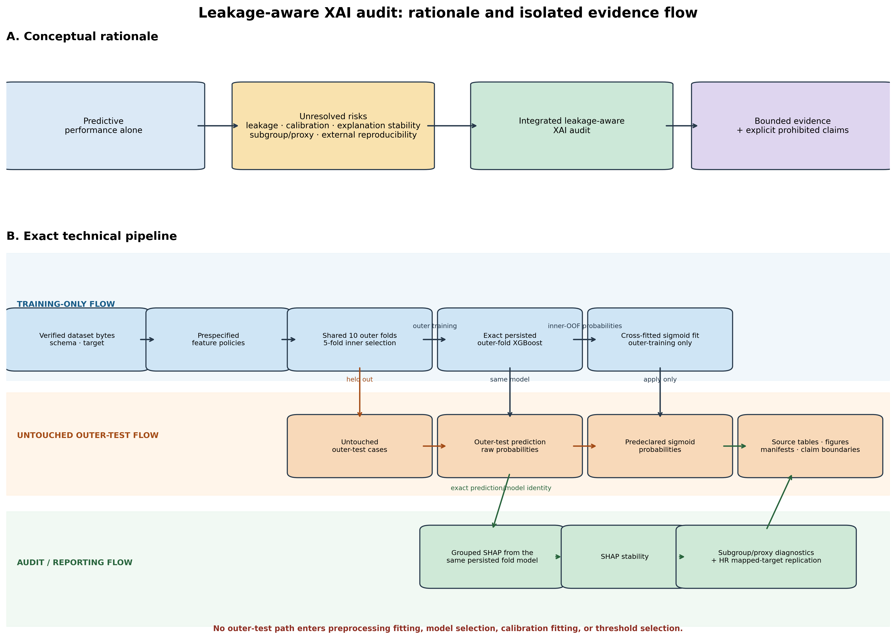
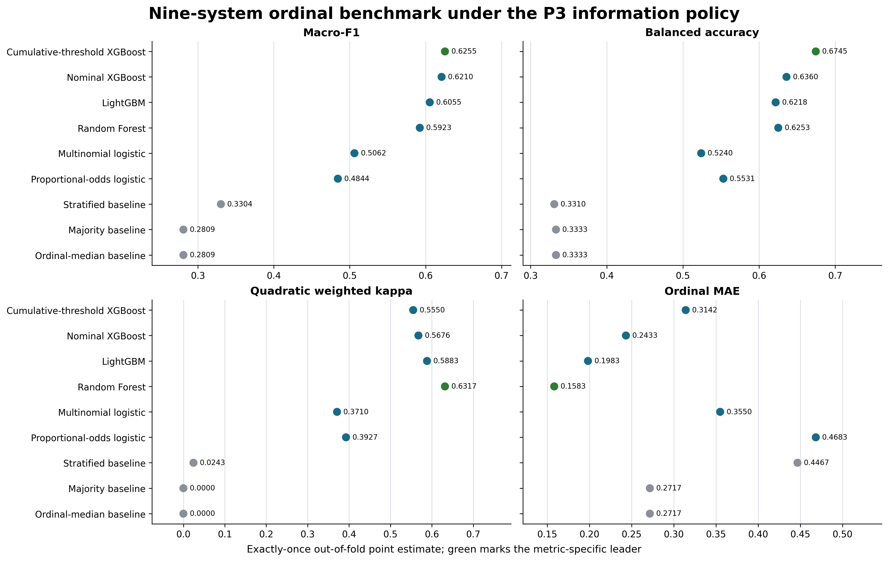
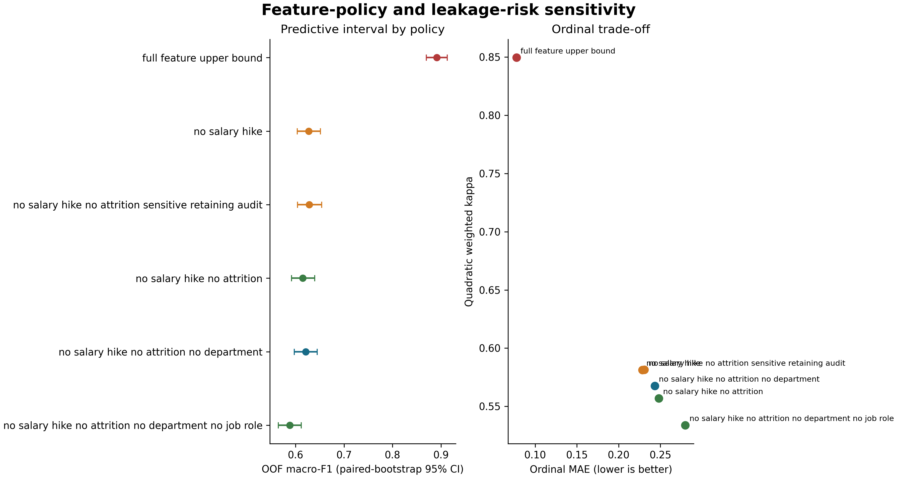
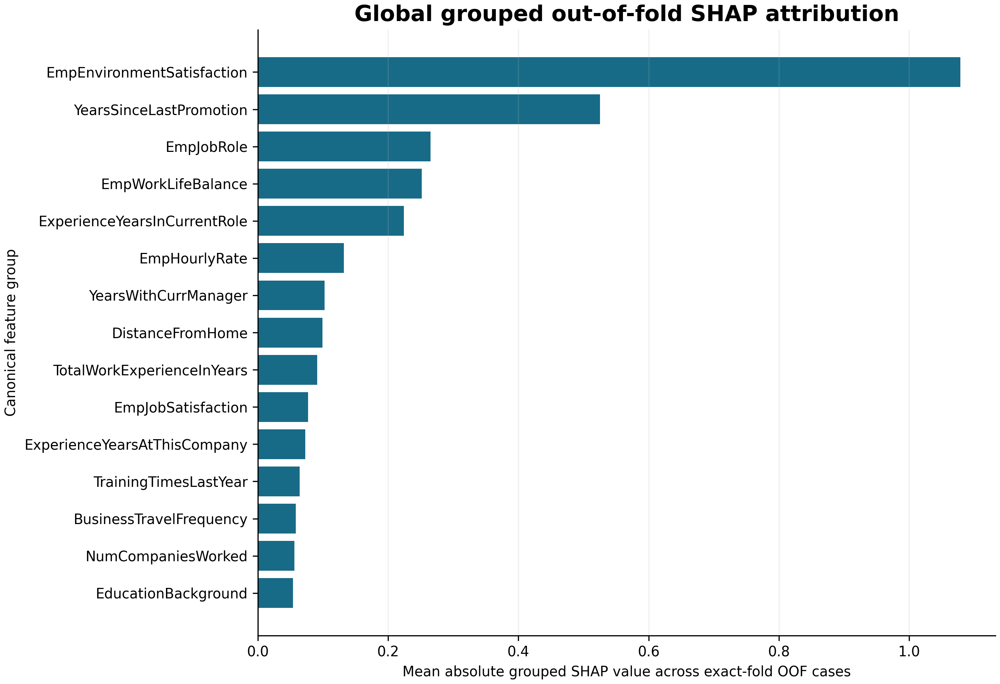
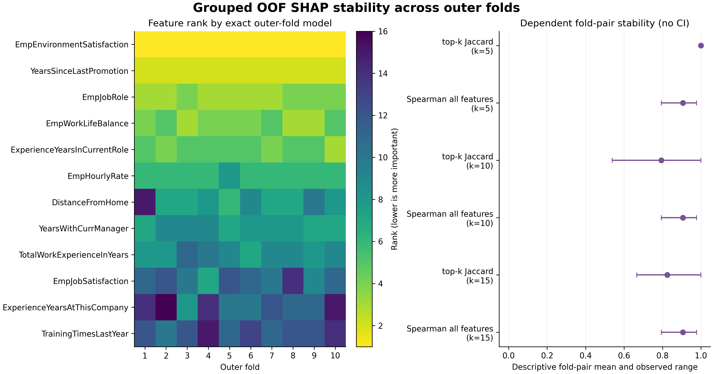
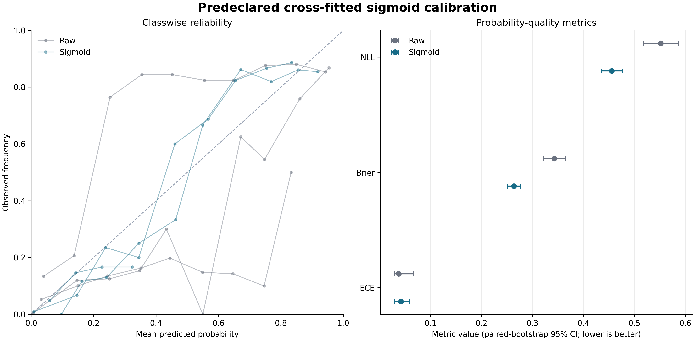
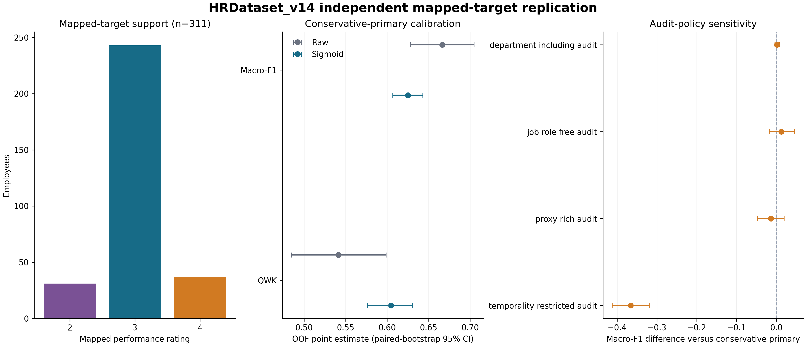

# Beyond Predictive Accuracy: A Reproducible Leakage- and Governance-Aware XAI Audit Protocol for Ordinal Employee Performance Prediction

**Article type:** Original Research Article

**Authors:** Muhammed Yusuf Batur^1,*^ and Mehmet Göktürk^2^

**Affiliations:** ^1^ Rumeli University, [AUTHOR TO COMPLETE]; ^2^ Gebze Technical University, [AUTHOR TO COMPLETE]

**Correspondence:** myusuf.batur@rumeli.edu.tr; [AUTHOR TO COMPLETE]

<!-- claim-boundary-sha256: 1664b188df14135d3b3de8642de3d080c25a3fbadc440615c2bd04b2f14ddabe -->

## Abstract

Employee-performance prediction is often summarized by a single accuracy score even though information availability, ordinal error severity, probability reliability, explanation stability, and organizational proxy channels can materially change the interpretation. We present a reproducible audit protocol for ordinal employee-performance prediction in two public cross-sectional tables. The protocol prespecifies six information policies, evaluates nine systems with exactly-once out-of-fold predictions, repeats nested cross-validation under five fixed designs, separates fixed-schedule from independently retuned policy contrasts, binds held-out predictions to exact-fold TreeSHAP explanations, tests attribution stability and deletion behavior, evaluates training-only cross-fitted sigmoid calibration, audits support-aware subgroup and proxy diagnostics, and performs an independently trained mapped-target replication. Under the primary INX policy, cumulative-threshold XGBoost led macro-F1 (0.6255) and balanced accuracy (0.6745), whereas Random Forest led quadratic weighted kappa (0.6317) and ordinal mean absolute error (0.1583). Cross-fitted sigmoid calibration reduced nominal-XGBoost log loss from 0.5515 to 0.4556 but increased top-label expected calibration error by 0.0044. Removing JobRole and refitting changed 10.75% of argmax predictions and reduced macro-F1 by 0.0330; separate department reconstruction fell from 0.9792 accuracy with JobRole to 0.2908 without it. The HRDataset_v14 mapped-target replication yielded mean raw-XGBoost macro-F1 of 0.6531 across five repetitions. These findings are descriptive of the audited samples and protocols: timestamps, construct validity, source rights, and prospective performance remain unresolved. The contribution is a shared, hash-bound evidence contract that keeps claims aligned with their data, folds, models, explanations, calibration path, and limitations.

**Keywords:** human-resource analytics; ordinal classification; explainable artificial intelligence; data leakage; nested cross-validation; SHAP stability; probability calibration; proxy diagnostics; reproducibility

## 1. Introduction

Algorithmic analysis of employee records can affect people even when a model is framed as decision support. HR data are typically small, organizationally produced, and entangled with prior managerial decisions. Consequently, an apparently strong classifier may exploit variables recorded during or after an evaluation, reproduce structural context, or report probabilities and explanations that have not been audited for reliability. HR scholarship therefore emphasizes accountability, employee reactions, personal integrity, and the limits of purely technical optimization [@tambe2019artificial; @leichtdeobald2019challenges; @kochling2020discriminated; @giermindl2021dark].

The employee-performance literature has compared conventional classifiers on the 1,200-row INX table and related organizational data [@archana2019application; @lather2019prediction; @li2021employee; @patel2022ranker; @adeniyi2022comparison; @nayem2024unbiased; @putri2026klasifikasi]. Such studies establish practical interest, but predictive ranking alone does not answer whether information was available before the rating, whether tuning remained inside training data, whether an ordinal error crossed two rating levels, or whether post-hoc explanations are stable and faithful.

This study contributes:

- a prespecified P0–P5 information contract distinguishing outcome-proximal, sensitive, timing-uncertain, and organizational-proxy fields;
- a nine-system ordinal benchmark plus repeated nested-cross-validation and policy-specific retuning, all based on exactly-once held-out predictions;
- exact-fold TreeSHAP, stability, deletion, calibration, subgroup, and proxy-use diagnostics with explicit noncausal and support-aware boundaries; and
- an independently trained HRDataset_v14 mapped-target replication plus a hash-bound claim matrix linking reported numbers to frozen source rows.

The intended use is methodological research and audit. The study does not establish a production HR system, causal determinants of performance, certified fairness, or prospective validity. Its targets are recorded organizational ratings, not validated measures of objective capability or productivity.

## 2. Related Work

### 2.1 Employee-performance prediction and HR decision support

Four verified studies in the bounded literature set use the exact INX data, while others use psychometric, organization-specific, HRDataset_v14, or newly collected employee-performance data [@archana2019application; @lather2019prediction; @li2021employee; @patel2022ranker; @adeniyi2022comparison; @nayem2024unbiased; @putri2026klasifikasi]. Related churn studies illustrate broader machine-learning and explanation work in people analytics but address different outcomes [@abufaty2025integrating; @chaudhary2025integrated]. Success on churn cannot be reinterpreted as validation of an ordinal performance-rating model.

### 2.2 Leakage, selection, and reproducible evaluation

Leakage arises when information encodes the target or would not be available at the claimed decision point [@kaufman2012leakage; @kapoor2023leakage]. Evaluating a configuration on the data used to select it also produces optimistic estimates, motivating nested separation of selection and evaluation [@cawley2010overfitting]. Reproducibility guidance calls for transparent processing, sample allocation, hyperparameters, uncertainty, and artifact reporting [@mitchell2019model; @pineau2021improving]. Our protocol combines these principles through persisted folds, training-only selection, exact output identities, and hashes.

### 2.3 Explanation stability and faithfulness

SHAP provides additive feature attributions, including efficient algorithms for tree models [@lundberg2017unified; @lundberg2020local]. Yet an attribution plot is not evidence of causality or reliability. Nearby inputs can produce unstable explanations, sensitivity and infidelity can be quantified, and post-hoc explanations can be manipulated [@alvarezmelis2018robustness; @yeh2019infidelity; @slack2020fooling]. We bind each held-out explanation to the exact prediction model, aggregate encoded columns to declared raw-feature families, and examine ranking stability separately from deletion behavior.

### 2.4 Calibration and subgroup/proxy boundaries

Classification and ordinal scores do not show whether probabilities are reliable. Post-hoc calibration can improve some metrics, but calibration is multidimensional and scalar summaries depend on the event and binning scheme [@guo2017calibration; @vaicenavicius2019evaluating]. In HR settings, removing direct attributes also does not remove every proxy channel or establish fairness. Our subgroup results are support-aware descriptive diagnostics, while department reconstructability is kept separate from performance-model output dependence.

### 2.5 Bounded positioning

Within the frozen 25-work, source-verified set, no selected work reports the complete shared evidence contract used here. This is not an exhaustive review. The contribution is mechanistic: joining information policy, nested selection, exact held-out prediction–explanation identity, training-only calibration, explanation stability and deletion, subgroup/proxy boundaries, independent replication, and manuscript-number provenance. It is not a claim of universal novelty.

## 3. Materials and Methods

### 3.1 Study design, estimand, and intended use

The INX analysis is a cross-sectional sensitivity study under explicit feature-availability assumptions, not an observed prospective prediction exercise (C001). The estimand treats `PerformanceRating` as an ordinal organizational rating with labels 2, 3, and 4. Feature-observation times and rating-decision time are absent, so retained variables are not verified as prospectively available.

The protocol is intended for research, model audit, and reproducibility assessment. It is not intended for autonomous hiring, dismissal, promotion, compensation, discipline, or employee ranking. Predictions and SHAP values describe fitted models under observed cross-sectional data, not individual prescriptions.

### 3.2 Datasets, targets, and data quality

INX is the primary development and internal out-of-fold evaluation table. It contains 1,200 rows and 28 columns; target support is 194/874/132 for ratings 2/3/4. HRDataset_v14 contains 311 rows and 36 raw columns. Its retained mapping combines `PIP` and `Needs Improvement` as class 2, preserves `Fully Meets` as 3, and maps `Exceeds` as 4, producing support 31/243/37. This study estimand does not validate equivalence between organizations' rating constructs.

The aggregate audit applies whitespace-aware missingness, duplicate checks, identifier rules, schema hashing, numeric-domain rules, and temporal/consistency rules fixed before the run. No source value was silently repaired. Provenance and redistribution rights require manual resolution, so raw employee-level tables are excluded.

**Table 1. Dataset roles, target mappings, and aggregate audit status**

| Dataset | Analytical role | Rows | Target support | Key boundary |
| --- | --- | ---: | --- | --- |
| INX | Primary development and internal OOF evaluation | 1200 | 2=194; 3=874; 4=132 | Cross-sectional; feature and decision timestamps unavailable |
| HRDataset_v14 | Independently trained mapped-target protocol replication | 311 | 2=31; 3=243; 4=37 | Different features, semantics, parameters, and population |

### 3.3 Prespecified information policies

Six policies progressively restrict information. P0 excludes only identifier and target and is a diagnostic upper bound. P1 removes declared outcome-proximal and temporal-risk variables. P2 also removes direct sensitive demographics. P3, the primary policy, removes department. P4 removes timing-uncertain surveys and related measures but remains prospective-plausibility sensitivity because timestamps are absent. P5 further removes declared role, compensation, assignment, promotion, and manager-context proxy channels; residual proxies may remain.

**Table 2. P0–P5 information policies**

| Policy | Role | Retained | Interpretation |
| --- | --- | ---: | --- |
| P0 Information-rich diagnostic | Diagnostic only | 26 | Outcome-proximal/timing-risk information retained |
| P1 Leakage-controlled | Outcome/temporal-risk ablation | 24 | High-risk fields removed; other risks remain |
| P2 Governance-controlled | Sensitive-feature ablation | 21 | Direct sensitive fields removed; not a fairness result |
| P3 Primary leakage-aware | Canonical primary | 20 | Department removed; timing uncertainty and proxies remain |
| P4 Strict prospective | Timestamp-unverified sensitivity | 13 | Semantically plausible prior fields only |
| P5 Strict proxy | Organizational-proxy sensitivity | 6 | Declared strong proxies removed; residual proxies possible |

### 3.4 Nine-system ordinal benchmark

The P3 benchmark includes nominal XGBoost, LightGBM, Random Forest, multinomial logistic regression, proportional-odds logistic regression, cumulative-threshold XGBoost, and stratified, majority, and ordinal-median baselines. The frozen benchmark uses ten outer folds with five-fold inner selection for trained systems. Every sample receives one outer-test prediction per system. Metrics include macro-F1, balanced accuracy, QWK, ordinal MAE, two-level reversal rate, normalized RPS, log loss, multiclass Brier, and top-label ECE.

The benchmark identifies metric-specific leaders, not a universally superior model (C002). Rankings are conditional on P3 and the frozen folds. Nominal XGBoost remains the downstream explanation/calibration reference because that choice was prespecified.

### 3.5 Repeated nested-cross-validation

Training and split variability use five fixed repetitions of 5-fold outer by 5-fold inner nested cross-validation. Each trained system is refitted in every repetition. Means, sample SDs, ranges, winner counts, and rank correlations are descriptive across the five repetition identities. Ranges are not confidence intervals (C003), and repetition pairs share samples.

### 3.6 Fixed-schedule and retuned policy contrasts

P0–P5 are evaluated using the P3-selected fixed schedule and independently retuned, policy-specific inner selection. The former more tightly controls model specification; the latter combines information access with model selection. These contrasts answer different descriptive questions and neither estimates a causal feature-policy effect (C004). No confidence intervals or significance tests are attached to retuned-minus-fixed differences.

### 3.7 Exact-fold SHAP stability and deletion diagnostics

For nominal XGBoost under P3, every held-out observation is explained by the persisted outer-fold model that generated its prediction. TreeSHAP values use raw-margin space; encoded columns are signed-summed to feature families before absolute values are averaged across classes and OOF observations. Stability is evaluated across outer-fold, model-seed, and stratified 80% outer-training-resample pairs using top-k Jaccard and all-feature Spearman agreement.

Deletion compares SHAP-ranked masking against 20 random repetitions at one, three, and five deleted features. Median/mode masking may generate out-of-distribution records. Stability and deletion behavior therefore characterize the fitted model and declared interventions, not causal effects, actionability, human usefulness, or advice (C005).

### 3.8 Cross-fitted calibration

Within each nominal-XGBoost outer fold, three one-vs-rest sigmoid calibrators are fitted only to five-fold cross-fitted outer-training probabilities. Outputs are renormalized; untouched outer-test outcomes are evaluation-only. Raw and sigmoid outputs are compared with log loss, Brier, top-label ECE, macro classwise ECE, cumulative ECE, and normalized RPS. ECE uses ten fixed equal-width bins and retains empty bins. Conclusions are metric-specific (C006).

### 3.9 Support-aware subgroup and proxy diagnostics

The subgroup audit covers three systems, six attributes, nine metrics, and support thresholds 20/30/50. Unsupported groups or class denominators remain explicit. P3 exploratory intervals use 5,000 bootstrap repetitions stratified by fold and class, with eligibility fixed before resampling; they condition on the fitted models and are not confirmatory fairness inference.

Proxy diagnostics separate prediction changes after refitting P3 without JobRole, output sensitivity when JobRole is shuffled within fold, and independent department reconstruction. Reconstructability shows information in a feature space, not use by the performance model. None establishes discrimination, fairness, causality, or legal compliance (C007).

### 3.10 Independent mapped-target replication

HRDataset_v14 uses a separate seven-feature conservative policy, its own nested selection, and five fixed 5×5 repetitions. Models are trained and tuned anew on its 311 records. This is an independently trained mapped-target protocol replication, not transport of a locked INX model (C008). Features, target semantics, parameters, and population differ.

### 3.11 Evidence identity and claim control

Each compact package records source run, inputs, exclusions, hashes, and manifest. The frozen Phase 5A matrix links 45 approved claims to source rows. Its SHA-256 is `1664b188df14135d3b3de8642de3d080c25a3fbadc440615c2bd04b2f14ddabe`; this manuscript is checked only against that boundary (C013). No model, calibrator, SHAP, bootstrap, or paid service call was rerun during assembly.

## 4. Results

### 4.1 Metric-specific benchmark leaders

The P3 comparison did not yield one winner. Cumulative-threshold XGBoost had highest macro-F1, 0.6255 (C101), and balanced accuracy, 0.6745 (C102). Random Forest had highest QWK, 0.6317 (C103), and lowest ordinal MAE, 0.1583 (C104). LightGBM had lowest normalized RPS, 0.0804 (C105), while nominal XGBoost had lowest raw log loss, 0.5515 (C106). Lower is preferable for MAE, RPS, and log loss; ranks apply only to evaluated P3 systems and metrics.

**Table 3. Nine-system exactly-once OOF benchmark under P3**

| System | Macro-F1 | Balanced acc. | QWK | Ordinal MAE | RPS | Log loss |
| --- | ---: | ---: | ---: | ---: | ---: | ---: |
| Cumulative-threshold XGBoost | 0.6255 | 0.6745 | 0.5550 | 0.3142 | 0.1029 | 1.3053 |
| Nominal XGBoost | 0.6210 | 0.6360 | 0.5676 | 0.2433 | 0.0860 | 0.5515 |
| LightGBM | 0.6055 | 0.6218 | 0.5883 | 0.1983 | 0.0804 | 0.5883 |
| Random Forest | 0.5923 | 0.6253 | 0.6317 | 0.1583 | 0.0822 | 0.5982 |
| Multinomial logistic | 0.5062 | 0.5240 | 0.3710 | 0.3550 | 0.1134 | 0.7142 |
| Proportional-odds logistic | 0.4844 | 0.5531 | 0.3927 | 0.4683 | 0.1405 | 0.8982 |
| Stratified baseline | 0.3304 | 0.3310 | 0.0243 | 0.4467 | 0.2233 | 15.1383 |
| Ordinal-median baseline | 0.2809 | 0.3333 | 0.0000 | 0.2717 | 0.1358 | 9.7919 |
| Majority baseline | 0.2809 | 0.3333 | 0.0000 | 0.2717 | 0.1358 | 9.7919 |

### 4.2 Repetition variability and ranking

Across five repeated designs, nominal XGBoost mean macro-F1 was 0.6288 (C201), versus 0.6249 for LightGBM (C202). LightGBM won macro-F1 in three repetitions and XGBoost in two. Random Forest ranked first for QWK in 5/5 repetitions (C203). Cumulative-threshold XGBoost ranked first for balanced accuracy in 4/5 repetitions (C204). Mean pairwise macro-F1 rank Spearman correlation was 0.926 across ten dependent repetition pairs (C205). These describe the fixed designs rather than population uncertainty.

**Table 4. Five-repetition nested-CV summaries**

| System | Macro-F1 mean ± SD | Balanced acc. mean ± SD | QWK mean ± SD | Ordinal MAE mean ± SD |
| --- | ---: | ---: | ---: | ---: |
| Nominal XGBoost | 0.6288 ± 0.0099 | 0.6446 ± 0.0094 | 0.5833 ± 0.0156 | 0.2335 ± 0.0150 |
| LightGBM | 0.6249 ± 0.0137 | 0.6364 ± 0.0127 | 0.6070 ± 0.0136 | 0.1902 ± 0.0051 |
| Cumulative-threshold XGBoost | 0.6155 ± 0.0059 | 0.6524 ± 0.0074 | 0.5451 ± 0.0083 | 0.3062 ± 0.0092 |
| Random Forest | 0.5955 ± 0.0027 | 0.6283 ± 0.0012 | 0.6311 ± 0.0022 | 0.1597 ± 0.0015 |

### 4.3 Information-policy sensitivity

For P2, retuning changed macro-F1 by +0.0185 versus its fixed schedule (C301). For P5, retuning changed QWK by −0.0344 although ordinal MAE improved (C302). Retuned P0 reached macro-F1 0.8943 (C303), but P0 retains outcome-proximal and timing-risk fields and is only a diagnostic upper bound. The P0–P3 difference warns about information access; it is not an admissible prospective estimate.

**Table 5. Fixed-schedule and independently retuned policy results**

| Policy | Fixed macro-F1 | Retuned macro-F1 | Fixed QWK | Retuned QWK | Fixed MAE | Retuned MAE |
| --- | ---: | ---: | ---: | ---: | ---: | ---: |
| P0 | 0.8914 | 0.8943 | 0.8496 | 0.8529 | 0.0775 | 0.0733 |
| P1 | 0.6279 | 0.6396 | 0.5814 | 0.5892 | 0.2308 | 0.2300 |
| P2 | 0.6150 | 0.6335 | 0.5569 | 0.5892 | 0.2483 | 0.2217 |
| P3 | 0.6210 | 0.6210 | 0.5676 | 0.5676 | 0.2433 | 0.2433 |
| P4 | 0.4117 | 0.4273 | 0.2095 | 0.2368 | 0.4833 | 0.4833 |
| P5 | 0.3460 | 0.3547 | 0.0945 | 0.0601 | 0.5958 | 0.5517 |

### 4.4 Explanation stability and deletion behavior

The top five feature families were identical across 15 model-seed pairs: mean top-5 Jaccard 1.0000 (C401). Across ten outer-training-resample pairs, mean all-feature Spearman was 0.9847 (C402). Canonical outer-fold pairs had mean all-feature Spearman 0.9066. Pairwise comparisons are dependent and have no confidence interval.

Deleting the top-ranked feature produced mean probability-drop contrast +0.2676 versus random deletion (C403). Contrasts remained +0.2481 at three features and +0.2063 at five. These support fitted-model sensitivity under the masking rule, not real-world intervention effects.

### 4.5 Calibration diagnostics

Sigmoid calibration reduced log loss from 0.5515 to 0.4556 (C501) and Brier from 0.3426 to 0.2634. Macro classwise ECE declined from 0.1070 to 0.0249, mean cumulative ECE from 0.0779 to 0.0184, and normalized RPS from 0.0860 to 0.0669. Top-label ECE changed by +0.0044, from 0.0375 to 0.0419, a worse point estimate whose paired interval spans zero (C502). Calibration performance depends on event and metric.

**Table 6. SHAP and probability-quality diagnostics**

| Diagnostic | Result | Boundary |
| --- | ---: | --- |
| Seed-pair top-5 Jaccard | 1.0000 | 15 dependent descriptive pairs |
| Resample all-feature Spearman | 0.9847 | 10 dependent descriptive pairs |
| Top-1 guided-minus-random drop | +0.2676 | Masking diagnostic, not causal effect |
| Raw → sigmoid log loss | 0.5515 → 0.4556 | Training-only cross-fitted calibrator |
| Raw → sigmoid Brier | 0.3426 → 0.2634 | Metric-specific improvement |
| Raw → sigmoid top-label ECE | 0.0375 → 0.0419 | Point estimate worsened by 0.0044 |

### 4.6 Subgroup and proxy diagnostics

Refitting P3 without JobRole changed argmax prediction for 10.75% of cases (C601), with proxy-reduced-minus-primary macro-F1 −0.0330 (C602). Marginal within-fold JobRole permutation produced mean total variation 0.1024 (C603); department-conditional permutation produced 0.0529 (C604). Marginal perturbation can create implausible combinations, and conditioning only on department is not a fully conditional test.

Separate department reconstruction accuracy was 0.9792 with JobRole (C605) and 0.2908 without it (C606). This documents an information channel but not how the performance model used department, absence of residual information, or discrimination.

**Table 7. Proxy-use and reconstructability diagnostics**

| Diagnostic | Value | Scope |
| --- | ---: | --- |
| P3 vs no-JobRole prediction-change rate | 10.75% | Paired OOF predictions after refitting |
| Macro-F1 difference, reduced minus P3 | −0.0330 | Descriptive refit contrast |
| Marginal permutation total variation | 0.1024 | 20 outcome-blind shuffles |
| Department-conditional total variation | 0.0529 | 20 outcome-blind shuffles |
| Reconstruction accuracy with JobRole | 0.9792 | Separate proxy task |
| Reconstruction accuracy without JobRole | 0.2908 | Separate proxy task |

### 4.7 Replication and data-quality findings

Under the retained HRDataset_v14 mapping, raw XGBoost mean macro-F1 was 0.6531 across five repetitions (C701). Sigmoid-XGBoost mean QWK was 0.6044 (C702), although its macro-F1 was lower than raw. Mapped class 2 contained 31 records (C703). Repetition ranges are not confidence intervals.

The INX table contained 1200 rows (C801). HRDataset_v14 contained 215 effective missing cells (C802): 207 termination dates aligned with non-terminated records and eight manager identifiers. Three of 29 declared rules had findings (C803), totaling six rule occurrences (C804): two review-before-hire cases, two target-text/identifier disagreements, and two department-text minority cases. Occurrences are not asserted as six unique erroneous employees; source values were retained.

**Table 8. HRDataset_v14 replication and data-quality results**

| Result | Value | Boundary |
| --- | ---: | --- |
| Raw XGBoost mean macro-F1 | 0.6531 | Five fixed 5×5 repetitions; independently trained |
| Sigmoid XGBoost mean QWK | 0.6044 | Metric-specific calibration effect |
| Mapped class-2 support | 31 | Study mapping; no construct equivalence |
| Effective missing cells | 215 | 1.92% under declared rule |
| Rules with findings | 3 of 29 | Declared-rule scope only |
| Anomaly occurrences | 6 | No row-level uniqueness claim |

## 5. Discussion

### 5.1 Accuracy alone obscures the result

The system leading macro-F1 and balanced accuracy differs from the system leading QWK and ordinal MAE; probability-quality leaders differ again. Repeated validation preserves this pattern: macro-F1 leadership alternates, whereas Random Forest leads QWK in each fixed repetition. A single “best model” statement would discard ordinal and probabilistic structure.

### 5.2 Information access is part of the estimand

P0’s high performance shows that the information contract matters, not that a high-performing prospective system exists. P3 removes outcome-proximal fields, direct demographics, and department, but retains timing-uncertain surveys and organizational proxies. P4/P5 make stronger semantic restrictions without verifying real-time availability. The justified claim is leakage-risk sensitivity under assumptions.

### 5.3 Explanations require identity and behavioral checks

Exact-fold explanation prevents presenting a full-data-model explanation beside cross-validated performance. High top-k agreement and stronger deletion drops support internal consistency under tested procedures. They do not validate causal or employee-level meaning; dependent pairs and artificial masking remain material limits.

### 5.4 Calibration and proxy evidence are multidimensional

Sigmoid calibration improved several probability metrics but worsened top-label ECE. Department reconstructability and JobRole-dependent output changes also answer different questions: information available to a decoder versus performance-model dependence under refitting or perturbation. Neither is a legal or causal test, but together they reveal governance risk missed by removing department alone.

### 5.5 Relation to prior work

Prior employee studies supply classifier comparisons, HR scholarship explains sociotechnical stakes, and explanation, leakage, calibration, and reproducibility research supplies individual audit methods. Within the frozen set, this study's contribution is the shared evidence contract. It guards against model/explanation mismatch, held-out calibration fitting, conflation of information-policy and retuning effects, unsupported fairness inference, and stale numbers. Relevant unobserved work may overlap these components (C010).

## 6. Limitations

First, both datasets are public cross-sectional tables with unresolved source-to-byte provenance and rights. Public availability does not establish authenticity, ownership, representativeness, or redistribution permission. No raw dataset is approved for publication (C011).

Second, feature and decision timestamps are absent. P0–P5 encode assumptions, not observed temporal order. P4 is prospective-plausibility sensitivity; P5 cannot establish absence of residual proxies.

Third, targets are recorded organizational ratings. Documentation does not establish objective capability, productivity, or future potential, and the audit does not establish construct validity (C009). The replication mapping does not prove category equivalence.

Fourth, samples are modest and imbalanced. Five-repetition ranges are not confidence intervals. Some subgroup/class cells are unsupported; exploratory intervals condition on observed sample, models, folds, and eligibility.

Fifth, SHAP values are noncausal raw-margin attributions. Stability pairs are dependent, masking can create out-of-distribution records, and no human study establishes explanation usefulness.

Sixth, calibration is retrospective on OOF predictions. ECE depends on binning/support; future reliability, decision thresholds, and organizational utility remain untested.

Seventh, proxy analyses are diagnostic. Refitting changes model and feature set; shuffles are artificial; reconstructability does not establish department use, discrimination, fairness, or legal compliance.

Eighth, HRDataset_v14 is independently trained mapped-target replication, not locked-model transport. Feature space, semantics, parameters, and population differ.

Finally, institutional review, consent wording, author roles, funding, conflicts, AI-use disclosure, software licensing, Git-history remediation, final release identity, and archive DOI remain unresolved. They cannot be inferred from analysis.

## 7. Conclusions

An ordinal employee-performance study changes meaning when information policy, evaluation nesting, explanation identity, calibration path, and proxy boundaries are explicit. Under P3, different systems led classification, ordinal, and probability metrics; retuning effects varied; SHAP rankings were descriptively stable but noncausal; calibration gains were metric-specific; and JobRole carried organizational-proxy risk. HRDataset_v14 replicated the protocol on a mapped target without transporting the INX model.

The durable output is an auditable evidence contract, not a production decision system. Future work requires timestamped data, validated constructs, authorized provenance, preregistered prospective evaluation, stronger conditional proxy tests, human-centered explanation studies, and institutionally approved governance before real employment use.

## Supplementary Materials

The Phase 5B package provides claim-to-source comparison, final tables and figures, validation, revision and experiment reports, reproducibility and limitations reports, reviewer-response draft, final review simulation, and original-versus-revised diff. Employee rows, folds, fitted models, and raw data are excluded.

## Author Contributions

[AUTHOR TO COMPLETE: approve CRediT roles for Muhammed Yusuf Batur and Mehmet Göktürk. Do not infer roles from repository activity.]

## Funding

[AUTHOR TO COMPLETE: provide funder and grant number, or explicitly confirm no external funding.]

## Institutional Review Board Statement

[AUTHOR/INSTITUTION TO COMPLETE: institution, review unit, determination, reference/application number, date, and approved wording. No approval, exemption, or not-applicable determination is asserted.] (C012)

## Informed Consent Statement

[AUTHOR/INSTITUTION TO COMPLETE: provide approved consent-applicability wording tied to provenance and ethics determination. No waiver or not-applicable determination is asserted.]

## Data Availability Statement

Aggregate evidence, schemas, hashes, and qualified upstream locators are provided in the repository. Raw employee-level datasets are excluded because no dataset has a complete authoritative source-to-byte and redistribution-rights chain. A final immutable release identifier and archive URL remain to be supplied.

## Acknowledgments

[AUTHOR TO COMPLETE, or remove this section.]

## Conflicts of Interest

[AUTHOR TO COMPLETE: provide disclosures approved by all authors, or explicitly confirm none.]

## Use of AI-Assisted Technologies

[AUTHOR AND JOURNAL-POLICY REVIEW REQUIRED: approve wording that accurately describes tools used for code assistance and drafting. No scientific result was accepted without deterministic evidence checks; no paid service call was made during Phase 5B.]

## References

The authoritative bibliography is `references.bib`; every cited entry belongs to the frozen, source-verified 25-work set.
