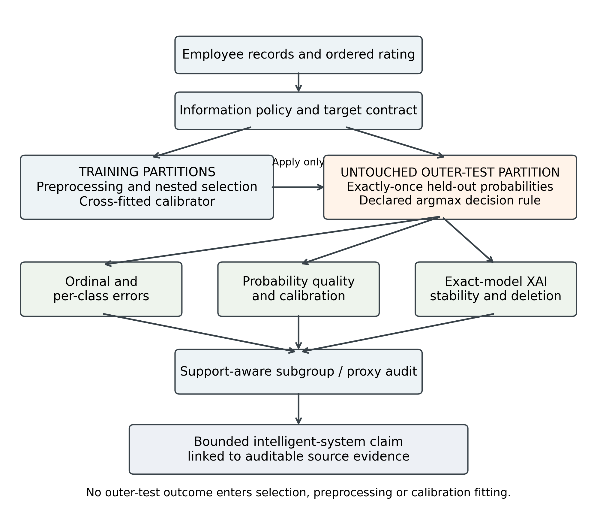
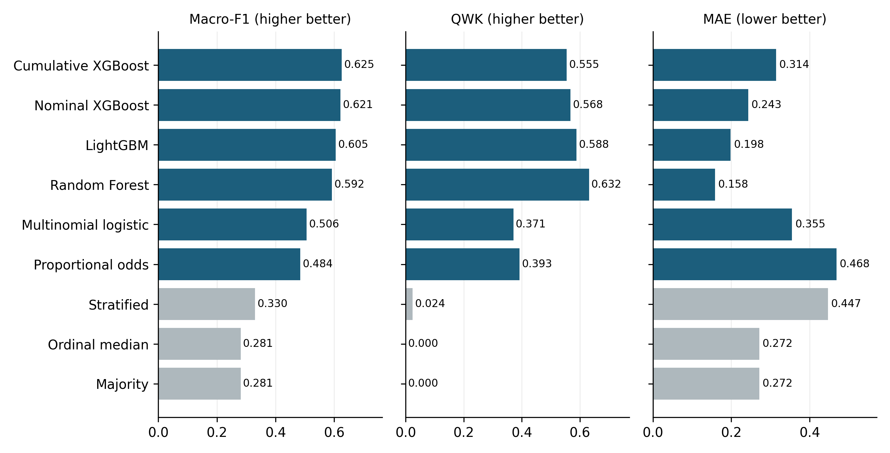
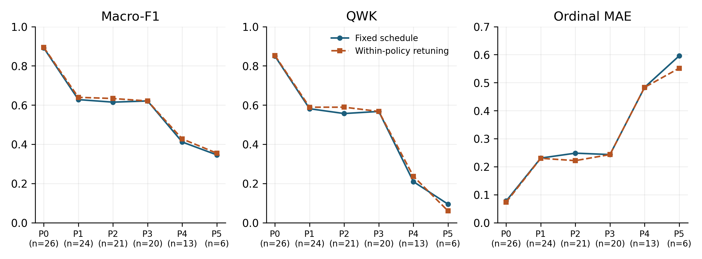
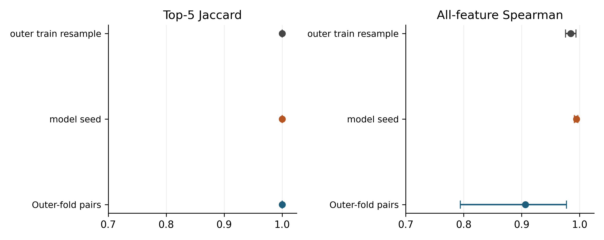
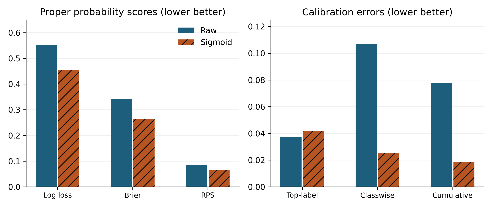

# Auditing Intelligent Employee-Performance Prediction Systems Beyond Accuracy: A Traceable XAI Protocol

**Author-review draft — not for submission. Mandatory author, institutional, rights, and portal decisions remain open.**

## Abstract

Intelligent human-resource prediction systems can appear reliable under aggregate scores while failing on consequential rating categories or relying on timing-uncertain information. We present an integrated audit protocol for ordinal employee-performance prediction that connects nested model selection, information policies, ordinal and per-class evaluation, training-only calibration, exact-model explanations, stability and deletion diagnostics, support-aware subgroup and proxy analysis, and traceable evidence. We examine it on a primary cross-sectional employee table and through secondary protocol sensitivity on a synthetic HR teaching dataset. Benchmark leaders differed across classification, ordinal, and probability metrics. In the canonical split, changing the selection objective altered 37 of 60 model-fold candidate choices. Across five repeated split identities, the macro-F1-versus-QWK trade-off was strongly replicated for nominal and cumulative-threshold XGBoost, with model-specific heterogeneity: both gained QWK while rating-4 recall fell in all five repetitions. Under canonical QWK selection, nominal XGBoost attained kappa 0.6418 while its highest-rating recall fell to 0.0076. Restricting timing-uncertain information reduced nominal-XGBoost macro-F1 by 0.1937 after independent retuning, although feature count also changed and the contrast does not isolate a temporal effect. Calibration findings depended on the metric; subgroup support and target mapping further limited interpretation. The protocol makes conflicting evidence visible and binds conclusions to the evaluated system. These results support bounded system-audit and protocol-portability claims, without establishing prospective performance, observed organizational transport, fairness certification, or deployment readiness.

**Keywords:** Employee performance prediction; Explainable artificial intelligence; Intelligent decision support; Ordinal classification; Model evaluation; Data leakage

## 1. Introduction

Intelligent human-resource decision support increasingly uses employee records to predict organizational outcomes. Performance-rating models are a particularly demanding case: the labels are ordered, their extreme categories can be sparse, and the records reflect organizational decisions as well as employee characteristics. HR scholarship documents the resulting accountability, personal-integrity, and employee-response concerns [@tambe2019artificial; @leichtdeobald2019challenges; @kochling2020discriminated; @giermindl2021dark]. Reliable system testing must therefore connect a predictive score to the information and decision conditions under which it was obtained.

An aggregate score can conceal an important operational failure. In the present benchmark, Random Forest achieved strong quadratic weighted kappa and ordinal mean absolute error while failing to recognize the highest recorded rating. Favorable probability metrics can likewise coexist with a worse calibration summary, and stable feature rankings need not establish causal explanation. These conflicts make evaluation of an intelligent prediction system a question of jointly interpreting several kinds of evidence.

Employee-performance studies have established interest in classifier comparisons on INX and related organizational data [@archana2019application; @lather2019prediction; @li2021employee; @patel2022ranker; @adeniyi2022comparison; @nayem2024unbiased; @putri2026klasifikasi]. Prediction, explanation, leakage, calibration, and subgroup analyses provide useful individual checks. The methodological need addressed here is to perform those checks under a shared held-out prediction contract, so that the model being explained, the probabilities being calibrated, and the system being evaluated remain identifiable.

We ask: How does the assessment of an intelligent employee-performance prediction system change when selection objective, information availability, ordinal severity, calibration, explanation reliability, and subgroup/proxy diagnostics are audited jointly?

The study makes four contributions:

- An operational audit protocol connects information availability, nested selection, held-out prediction, and permissible system claims.
- A common benchmark and selection-objective sensitivity analysis expose disagreement between aggregate ordinal performance and extreme-class recognition.
- Fixed-schedule and independently retuned information policies separate feature-access sensitivity from the additional effects of within-policy selection.
- Calibration, explanation stability and deletion, support-aware subgroup/proxy diagnostics, and protocol portability under a second synthetic schema are linked through traceable aggregate evidence.

The target is the recorded organizational rating, not a validated measure of capability or productivity. The intended application is research and system audit; prospective validity, causal determinants, fairness certification, and autonomous employment decisions are outside the supported claims.

## 2. Related Work

### 2.1 Employee-performance prediction and HR decision support

Three verified studies in the bounded literature set use the exact INX data for employee-performance prediction [@archana2019application; @patel2022ranker; @putri2026klasifikasi]. A fourth exact-INX study predicts attrition rather than performance [@abufaty2025integrating]. Other studies use psychometric, organization-specific, HRDataset_v14, or newly collected employee-performance data [@lather2019prediction; @li2021employee; @adeniyi2022comparison; @nayem2024unbiased]. Related churn studies illustrate broader machine-learning and explanation work in people analytics but address different outcomes [@abufaty2025integrating; @chaudhary2025integrated]. Success on churn cannot be reinterpreted as validation of an ordinal performance-rating model.

### 2.2 Ordinal modelling and evaluation

Ordinal labels require evaluation that respects order without hiding class-specific behavior. Proportional-odds models impose a shared-slope cumulative-link structure [@mccullagh1980regression], while threshold decompositions adapt binary classifiers to ordered outcomes [@frank2001simple]. Ordinal assessment can combine nominal discrimination with distance-aware measures [@cardoso2011measuring], including weighted kappa [@cohen1968weighted] and ranked probability scoring [@epstein1969scoring; @gneiting2007strictly]. These aggregate criteria must still be accompanied by per-class results because a favorable distance-weighted score does not guarantee detection of a rare extreme category.

The benchmark includes Random Forest [@breiman2001random], XGBoost [@chen2016xgboost], and LightGBM [@ke2017lightgbm] alongside linear and ordinal systems. Algorithm pedigree does not determine which metric a system will lead, so selection objectives and class-specific behavior are treated as empirical parts of the evaluation contract.

### 2.3 Leakage, selection, and reproducible evaluation

Leakage arises when information encodes the target or would not be available at the claimed decision point [@kaufman2012leakage; @kapoor2023leakage]. Evaluating a configuration on the data used to select it also produces optimistic estimates, motivating nested separation of selection and evaluation [@cawley2010overfitting]. Reproducibility guidance calls for transparent processing, sample allocation, hyperparameters, uncertainty, and artifact reporting [@mitchell2019model; @pineau2021improving]. Our protocol combines these principles through persisted folds, training-only selection, exact output identities, and hashes.

### 2.4 Explanation stability and faithfulness

SHAP provides additive feature attributions, including efficient algorithms for tree models [@lundberg2017unified; @lundberg2020local]. Broader XAI taxonomies also show that explanation methods differ in scope, mechanism, and limitation [@abusitta2024survey]. Yet an attribution plot is not evidence of causality or reliability. Nearby inputs can produce unstable explanations, sensitivity and infidelity can be quantified, and post-hoc explanations can be manipulated [@alvarezmelis2018robustness; @yeh2019infidelity; @slack2020fooling]. We bind each held-out explanation to the exact prediction model, aggregate encoded columns to declared raw-feature families, and examine ranking stability separately from deletion behavior.

### 2.5 Calibration and subgroup/proxy boundaries

Classification and ordinal scores do not show whether probabilities are reliable. Post-hoc calibration can improve some metrics, but calibration is multidimensional and scalar summaries depend on the event and binning scheme [@guo2017calibration; @vaicenavicius2019evaluating]. In HR settings, removing direct attributes also does not remove every proxy channel or establish fairness. Organizational case evidence further shows that technical HR analytics must be situated within data-governance and ethical controls [@bargil2024ai]. Our subgroup results are support-aware descriptive diagnostics, while department reconstructability is kept separate from performance-model output dependence.

### 2.6 Bounded positioning

Recent work in *Expert Systems with Applications* treats explanation reliability as a substantive evaluation problem. Calibrated explanations attach uncertainty information to probability estimates and feature contributions [@lofstrom2024calibrated], while stability measures test how local feature rankings respond to small data changes [@sepulveda2025enhancing]. An organizational attrition study uses SHAP to examine feature contributions [@manafivarkiani2025predicting], and rule-oriented regression illustrates how explicit conditions can expose unwanted training-data patterns [@rass2026statistically]. These studies address complementary reliability questions; their outcomes and perturbations are not interchangeable with ordinal employee-performance evaluation.

Reporting guidance such as REFORMS calls for transparent validation and reproducibility [@kapoor2024reforms], and broader guidance identifies recurring machine-learning pitfalls [@lones2024avoiding]. The methodological gap addressed here is the traceable connection between audit questions that can produce conflicting conclusions about the same prediction system. Our contribution is an operational integration for ordinal employee-performance prediction: fixed evidence identities connect selection-objective sensitivity, information-availability policies, class-level and ordinal errors, probability reliability, explanation tests, and subgroup/proxy diagnostics. This makes disagreements between aggregate scores and specific failure modes inspectable. The positioning is bounded and is neither a world-first nor an exhaustive-review claim.

## 3. Materials and Methods

### 3.1 Study design, estimand, and intended use

The INX analysis is a cross-sectional sensitivity study under explicit feature-availability assumptions, not an observed prospective prediction exercise. The estimand treats `PerformanceRating` as an ordinal organizational rating with labels 2, 3, and 4. Feature-observation times and rating-decision time are absent, so retained variables are not verified as prospectively available.

The protocol is intended for research, model audit, and reproducibility assessment. It is not intended for autonomous hiring, dismissal, promotion, compensation, discipline, or employee ranking. Predictions and SHAP values describe fitted models under observed cross-sectional data, not individual prescriptions.

**Table 1. Operational audit gates and permitted claims**

| Stage | Input and audit | Failure condition | Permissible interpretation |
| --- | --- | --- | --- |
| Information | Feature timing and availability contract | Timing unverified | Sensitivity only |
| Selection | Nested training-only model selection | Test-informed selection | Evaluation invalid |
| Prediction | Held-out probabilities and per-class ordinal metrics | Extreme-class failure | Bound aggregate claim |
| Calibration | Cross-fitted training probabilities | Test-fit calibration | Calibration invalid |
| Explanation | Exact-fold model and attribution checks | Model identity mismatch | No explanation claim |
| Subgroup | Held-out outputs and support-aware intervals | Insufficient denominators | Descriptive or not estimated |

**Algorithm 1. Traceable audit protocol**

Input: dataset, ordered target, feature-information contract, candidate-model registry, selection rule, and fixed split identities.

1. Define the target, intended decision context, information policy, and claim limits.
2. Construct outer evaluation folds and inner training-only selection folds.
3. Fit preprocessing and choose candidates using only the relevant training partition.
4. Refit the selected model on outer-training data and predict its untouched outer-test fold exactly once.
5. Generate selected-candidate inner cross-fitted training probabilities; fit the predeclared calibrator on these probabilities and apply it to outer-test probabilities.
6. Evaluate aggregate ordinal scores, probability quality, and per-class errors using the declared decision rule.
7. Bind each held-out explanation to its exact prediction-producing fold model.
8. Assess explanation aggregation, ranking stability, and deletion behavior separately.
9. Evaluate subgroup support, exploratory uncertainty, and the distinct proxy questions.
10. Record source identities and bound each reported claim to its evidence.

Output: a traceable report of the evaluated system and the claims its evidence permits. Supplementary Table S5 provides the complete audit-gate specification. Figure 1 shows the separation between training operations and held-out assessment.

### 3.2 Datasets, targets, and data quality

INX is the primary development and internal out-of-fold (OOF) evaluation table. It contains 1,200 rows and 28 columns; target support is 194/874/132 for ratings 2/3/4. HRDataset_v14 is a publicly available synthetic teaching dataset created for a graduate HR case study and representing a fictitious organizational setting. It contains 311 rows and 36 raw columns. The retained three-class mapping combines `PIP` and `Needs Improvement` as class 2, preserves `Fully Meets` as 3, and maps `Exceeds` as 4, producing support 31/243/37. A prespecified sensitivity retains the two lower source categories as distinct ordered classes, producing four-class support 13/18/243/37. These are different estimands; neither establishes equivalence with the INX rating construct or a real organizational population.

The aggregate audit applies whitespace-aware missingness, duplicate checks, identifier rules, schema hashing, numeric-domain rules, and temporal/consistency rules fixed before analysis. No source value was silently repaired. Provenance and redistribution rights require manual resolution, so raw employee-level tables are excluded.

**Table 2. Dataset roles, target mappings, and aggregate audit status**

| Dataset/estimand | Analytical role | Rows | Target support | Key boundary |
| --- | --- | ---: | --- | --- |
| INX, three ratings | Primary development and internal OOF evaluation | 1200 | 2=194; 3=874; 4=132 | Cross-sectional; feature and decision timestamps unavailable |
| HRDataset_v14, retained three-class mapping | Secondary protocol sensitivity on synthetic teaching data | 311 | 2=31; 3=243; 4=37 | Fictitious setting; not real-world transport evidence |
| HRDataset_v14, four-class sensitivity | Synthetic-data target-formulation sensitivity | 311 | 13/18/243/37 | Distinct estimand; not an accuracy-improvement comparison |

### 3.3 Prespecified information policies

Six policies progressively restrict information. P0 excludes only identifier and target and is an information-rich diagnostic comparator; its superiority is not guaranteed. P1 removes declared outcome-proximal and temporal-risk variables. P2 also removes direct sensitive demographics. P3, the primary policy, removes department. P4 removes timing-uncertain surveys and related measures but remains only a prospective-plausibility sensitivity because timestamps are absent. P5 further removes declared role, compensation, assignment, promotion, and manager-context proxy channels; residual proxies may remain.

**Table 3. P0–P5 information policies**

| Policy | Role | Retained | Interpretation |
| --- | --- | ---: | --- |
| P0 Information-Rich Diagnostic | Diagnostic only | 26 | Outcome-proximal/timing-risk information retained |
| P1 Leakage-Risk-Controlled | Outcome/temporal-risk ablation | 24 | High-risk fields removed; other risks remain |
| P2 Direct-Sensitive-Attribute-Excluded | Sensitive-feature ablation | 21 | Direct sensitive fields removed; not a fairness result |
| P3 Primary Leakage-Aware | Canonical primary | 20 | Department removed; timing uncertainty and proxies remain |
| P4 Prospective-Plausibility | Timestamp-unverified sensitivity | 13 | Semantically plausible prior fields only |
| P5 Strict Proxy-Reduced Prospective-Plausibility | Organizational-proxy sensitivity | 6 | Declared strong proxies removed; residual proxies possible |

### 3.4 Preprocessing, models, and ordinal construction

Preprocessing is fitted anew within the current inner-development or outer-training partition. Numeric variables receive median imputation and standard scaling. Categorical variables receive most-frequent imputation and dense one-hot encoding with unknown categories ignored. Outer-test rows are evaluation-only and never fit preprocessing, choose a candidate, calibrator, seed, or information policy.

The P3 benchmark contains six trained systems—multinomial logistic regression, Random Forest [@breiman2001random], LightGBM [@ke2017lightgbm], nominal XGBoost [@chen2016xgboost], proportional-odds logistic regression, and cumulative-threshold XGBoost—plus stratified, majority, and ordinal-median baselines. Logistic and proportional-odds models search six combinations of regularization strength (0.1, 1, 10) and optional balancing. Random Forest searches eight combinations of maximum depth (unrestricted or 8), minimum leaf size (1 or 3), and optional balancing. LightGBM searches eight combinations of leaves (15 or 31), minimum child size (20 or 40), and optional balancing. Nominal XGBoost searches eight combinations of depth (3 or 5), minimum child weight (1 or 5), and optional balancing; cumulative-threshold XGBoost uses the analogous eight combinations with depth 2 or 3. Fixed estimator settings and complete registries are given in Supplementary Table S2.

The proportional-odds model is a cumulative-link model with shared feature coefficients across ordered cut points and increasing fitted thresholds [@mccullagh1980regression]. Its shared-slope assumption is a model restriction, not an empirical claim of identical effects. Cumulative-threshold XGBoost independently estimates `P(Y>2)` and `P(Y>3)` [@frank2001simple]. A rowwise nonincreasing pool-adjacent-violators projection corrects crossing cumulative probabilities before class probabilities are obtained by differencing and normalized. This construction supplies ordered probabilities but does not guarantee recognition of the extreme class.

Hard class predictions were obtained using the unmodified argmax of class probabilities. No class-specific threshold optimization was performed. Label-only baselines use their declared hard-label rules.

### 3.5 Nested benchmark and selection-objective sensitivity

The canonical benchmark uses persisted stratified ten-fold outer splits and five-fold inner splits shared across systems. Every row receives exactly one outer-test prediction per system. The canonical selection regime maximizes inner macro-F1, admits candidates within an inclusive 0.001 tolerance, then uses QWK and the lowest candidate index as deterministic tie-breaks. The sensitivity regime reverses macro-F1 and QWK while retaining identical folds, candidate registries, tolerance, and outer evaluation; canonical OOF predictions are reused, whereas QWK-selected models are refitted in every outer fold. No MAE- or RPS-selected regime was added after inspecting the results.

We report selected-candidate changes, metric-leader changes, complete-ordering changes, and metric-effect magnitudes separately. A lower-rank swap alone is not interpreted as material dependence. Metrics are macro-F1, balanced accuracy, QWK [@cohen1968weighted], ordinal MAE, two-level reversal rate, normalized ranked probability score (RPS) [@epstein1969scoring; @gneiting2007strictly], log loss, multiclass Brier score, and top-label expected calibration error (ECE). An empirical-prior predictor, estimated separately from each outer-training partition, is retained as a probability-quality reference; zero pooled top-label ECE for this fold-specific constant-probability construction is not evidence of perfect calibration.

### 3.6 Repeated nested cross-validation

Training and split variability use five fixed repetitions of 5-fold outer by 5-fold inner nested cross-validation. Each trained system is selected and refitted in every repetition. The repeated selection-objective sensitivity reuses these exact outer and inner split identities, preprocessing, six trained-system registries, candidate grids, estimator seeds, inclusive 0.001 tolerance, and deterministic tie logic. Existing macro-F1-selected OOF predictions are reused; QWK selection adds one refit per system and outer fold, for 150 new outer fits and no new inner or baseline fits. Selection uses inner evidence only. Means, sample SDs, ranges, winner counts, and rank correlations are descriptive across the five repetition identities. Ranges and direction counts are not confidence intervals, and repetition pairs share samples.

### 3.7 Fixed-schedule and retuned information-policy contrasts

The nominal-XGBoost information-policy sensitivity experiment evaluates P0–P5 using the P3-selected fixed schedule and independently retuned, policy-specific inner selection. The fixed analysis more tightly controls model specification; retuning combines changed information access with changed selection. P3 is the common anchor. The P3→P4 and P4→P5 contrasts therefore expose timing/information sensitivity under both schedules, but neither schedule estimates a causal feature-policy effect. No confidence intervals or significance tests are attached to retuned-minus-fixed differences.

### 3.8 Exact-fold SHAP stability and deletion diagnostics

For nominal XGBoost under P3, every held-out observation is explained by the persisted outer-fold model that generated its prediction. TreeSHAP uses tree-path-dependent raw-margin explanations without a separate background dataset. Encoded columns are signed-summed to feature families before absolute values are averaged across classes and OOF observations. Stability is evaluated across outer-fold, model-seed, and stratified 80% outer-training-resample pairs using top-k Jaccard and all-feature Spearman agreement.

Deletion compares SHAP-ranked masking against 20 random repetitions at one, three, and five deleted features. Features are ranked separately for each observation by absolute grouped attribution for its original predicted class. Masking uses numeric medians and categorical modes from the corresponding outer-training partition, and the reported drop is in that original class's uncalibrated probability. Median/mode masking may generate out-of-distribution records. Stability and deletion behavior therefore characterize the fitted model and declared interventions, not causal effects, actionability, human usefulness, or advice.

### 3.9 Cross-fitted calibration

Within each nominal-XGBoost outer fold, three one-vs-rest sigmoid calibrators are fitted only to five-fold cross-fitted outer-training probabilities. Outputs are renormalized; untouched outer-test outcomes are evaluation-only. Raw and sigmoid outputs are compared with log loss, Brier score, top-label ECE, macro classwise ECE, cumulative ECE, and normalized RPS. ECE uses ten fixed equal-width bins and retains empty bins. Conclusions are metric-specific.

### 3.10 Support-aware subgroup and proxy diagnostics

The subgroup audit covers three exact canonical systems, all six prespecified attributes (Age, Gender, Marital Status, Business Travel, Department, and Education), nine metrics, and support thresholds 20/30/50. Unsupported groups or class denominators remain explicit. The primary manuscript summary is the **P3 nominal-XGBoost subgroup diagnostic**: P3 names the feature policy, and nominal XGBoost names the fitted-system family. It uses the prespecified threshold of 30 and 5,000 bootstrap repetitions stratified by fold and class, with eligibility fixed before resampling. The 95% simultaneous exploratory intervals use the studentized maximum absolute bootstrap deviation over all estimable prespecified P3 nominal-XGBoost attribute, support-threshold, and metric gap cells, including threshold-sensitivity cells. They condition on fixed fitted models, folds, and support eligibility, exclude model-training variability, and are not confirmatory fairness inference. “Gender” denotes the source-record field; its collection process and correspondence to sex or gender identity are not established. Subgroup comparisons describe these recorded categories and are not generalized to all six trained systems.

Proxy diagnostics separate prediction changes after refitting P3 without JobRole, output sensitivity when JobRole is shuffled within fold, and independent department reconstruction. Reconstructability shows information in a feature space, not use by the performance model. None establishes discrimination, fairness, causality, or legal compliance.

### 3.11 HR target mapping, CV design, and target-alias sensitivity

HRDataset_v14 provides secondary protocol sensitivity on a synthetic HR teaching dataset, with models trained anew on a separate seven-feature conservative policy: `EmpJobRole`, `EngagementSurvey`, `EmpJobSatisfaction`, `SpecialProjectsCount`, `DaysLateLast30`, `Absences`, and `ExperienceYearsAtThisCompany`. Feature-observation and rating-decision timestamps are unavailable, so temporal availability is not established. For target-formulation sensitivity, the retained three-class mapping and distinct four-class mapping each use five fixed repetitions of 5-fold outer by 5-fold inner nested validation, with selection and cross-fitted sigmoid calibration confined to outer-training data. The two mappings define different estimands and are not treated as an improvement comparison. Because the source represents a fictitious setting, this analysis assesses methodological portability under another schema rather than real-world organizational transport.

CV-design sensitivity compares the canonical 10-fold-outer/5-fold-inner estimates with the ranges from repeated 5-fold-outer/5-fold-inner analysis. Range inclusion is a descriptive stability check, not an equivalence test or confidence statement. Target-alias sensitivity preserves the 311-row result from the first repeated 5×5 design, removes the two target-text/identifier disagreement rows from those predictions to obtain fit-free metrics on 309 rows, and separately selects/refits on those same 309 rows using consistently restricted fold identities. The primary training/data-rule comparison is therefore matched-population 309-row restricted first-design predictions versus 309-row exclusion/refit predictions; the 311→309 contrast is reported separately as a sample-removal effect.

### 3.12 Evidence identity and claim control

Each aggregate evidence package records input identities, preprocessing and feature contracts, source hashes, and an inventory. Every reported numerical claim is linked to a particular source row and its stored value in the Supplementary Evidence Ledger. Model, probability, explanation, and evaluation identities are checked before results are combined. This supports traceability of the reported evaluation while keeping employee records and fitted objects outside the distributed scientific supplement.

### 3.13 Research software assistance

Generative AI tools assisted research coding and documentation. The authors retain responsibility for the implementation, selection of analyses, and interpretation. Scientific outputs were checked through persisted input and model identities, independent replay or recomputation, and automated validation. The complete verified tool inventory and human-review attestation remain an author action; this draft is not for submission until that record is approved.

## 4. Results

### 4.1 Main intelligent-system benchmark

The P3 comparison did not yield one winner. Cumulative-threshold XGBoost had the highest macro-F1 (0.6255) and balanced accuracy (0.6745). Random Forest had the highest QWK (0.6317) and lowest ordinal MAE (0.1583). LightGBM had the lowest normalized RPS (0.0804), whereas nominal XGBoost had the lowest raw log loss (0.5515). Lower is preferable for MAE, RPS, and log loss; these ranks apply only to evaluated P3 systems and metrics.

Aggregate ordinal performance did not guarantee extreme-class success. Despite leading QWK and MAE, Random Forest had rating-4 recall 0.0000. Under the macro-F1-selected regime, cumulative-threshold XGBoost had rating-4 recall 0.4167 but substantially worse MAE (0.3142) than Random Forest. Thus, neither an aggregate improvement nor a metric-leader label should be read as adequate recognition of rating 4.

**Table 4. Nine-system exactly-once OOF benchmark under P3**

| System | Macro-F1 | Balanced acc. | QWK | Ordinal MAE | RPS | Log loss |
| --- | ---: | ---: | ---: | ---: | ---: | ---: |
| Cumulative-threshold XGBoost | 0.6255 | 0.6745 | 0.5550 | 0.3142 | 0.1029 | 1.3053 |
| Nominal XGBoost | 0.6210 | 0.6360 | 0.5676 | 0.2433 | 0.0860 | 0.5515 |
| LightGBM | 0.6055 | 0.6218 | 0.5883 | 0.1983 | 0.0804 | 0.5883 |
| Random Forest | 0.5923 | 0.6253 | 0.6317 | 0.1583 | 0.0822 | 0.5982 |
| Multinomial logistic | 0.5062 | 0.5240 | 0.3710 | 0.3550 | 0.1134 | 0.7142 |
| Proportional-odds logistic | 0.4844 | 0.5531 | 0.3927 | 0.4683 | 0.1405 | 0.8982 |
| Stratified baseline | 0.3304 | 0.3310 | 0.0243 | 0.4467 | — | — |
| Ordinal-median baseline | 0.2809 | 0.3333 | 0.0000 | 0.2717 | — | — |
| Majority baseline | 0.2809 | 0.3333 | 0.0000 | 0.2717 | — | — |

Hard-label baselines are not treated as probabilistic comparators. Their probability metrics are therefore omitted; the training-only empirical class-prior predictor supplies the probability reference.

### 4.2 Selection objective and extreme-class failure

Changing the inner selection objective from macro-F1 to QWK changed 37 of 60 outer-fold selected candidates. It changed the metric leader for 6 of 9 reported metrics and the complete ordering for all 9, but those three facts are not collapsed into a binary claim that the ranking “depends.” The effect magnitudes and class-specific consequences varied by system. QWK selection raised nominal-XGBoost QWK from 0.5676 to 0.6418 and reduced MAE from 0.2433 to 0.1525, while macro-F1 fell from 0.6210 to 0.6014 and rating-4 recall fell from 0.1742 to 0.0076. Cumulative-threshold XGBoost showed a similar trade-off: QWK rose by 0.0769, from 0.5550 to 0.6319, and MAE fell from 0.3142 to 0.1533, while rating-4 recall fell from 0.4167 to 0.0000. Smaller lower-order changes are reported without being interpreted automatically as material.

**Table 5. Selection-objective sensitivity for the four leading trained systems**

| System | Regime | Macro-F1 | QWK | MAE | RPS | Rating-4 recall |
| --- | --- | ---: | ---: | ---: | ---: | ---: |
| Cumulative-threshold XGBoost | Macro-F1 selected | 0.6255 | 0.5550 | 0.3142 | 0.1029 | 0.4167 |
| Cumulative-threshold XGBoost | QWK selected | 0.5912 | 0.6319 | 0.1533 | 0.0666 | 0.0000 |
| LightGBM | Macro-F1 selected | 0.6055 | 0.5883 | 0.1983 | 0.0804 | 0.0606 |
| LightGBM | QWK selected | 0.5987 | 0.6097 | 0.1700 | 0.0756 | 0.0303 |
| Random Forest | Macro-F1 selected | 0.5923 | 0.6317 | 0.1583 | 0.0822 | 0.0000 |
| Random Forest | QWK selected | 0.5906 | 0.6335 | 0.1567 | 0.0832 | 0.0000 |
| Nominal XGBoost | Macro-F1 selected | 0.6210 | 0.5676 | 0.2433 | 0.0860 | 0.1742 |
| Nominal XGBoost | QWK selected | 0.6014 | 0.6418 | 0.1525 | 0.0675 | 0.0076 |

See Supplementary Table S4 for precision, recall, F1 and support for ratings 2/3/4.

The empirical class-prior probability reference had log loss 0.7683, Brier score 0.4313, RPS 0.1167, and top-label ECE 0.0000. Its zero top-label ECE results from the constant confidence construction and does not imply perfect classwise or ordinal calibration.

#### Repetition variability and ranking

Across five repeated designs, nominal XGBoost mean macro-F1 was 0.6288, versus 0.6249 for LightGBM. LightGBM won macro-F1 in three repetitions and XGBoost in two. Random Forest ranked first for QWK in 5/5 repetitions, and cumulative-threshold XGBoost ranked first for balanced accuracy in 4/5 repetitions. Mean pairwise macro-F1 rank Spearman correlation was 0.926 across ten dependent repetition pairs. These describe the fixed designs rather than population uncertainty.

Repeating the macro-F1-versus-QWK selection comparison on those same five split identities changed 15, 20, 17, 20, and 20 of 30 candidate choices (92/150 overall); the complete six-model ordering changed for all seven compared aggregate metrics in every repetition. For nominal XGBoost, mean QWK increased from 0.5833 to 0.6377 and mean ordinal MAE fell from 0.2335 to 0.1550, while mean rating-4 recall fell from 0.1894 to 0.0167. QWK and MAE improved and rating-4 recall deteriorated in all five repetitions. Cumulative-threshold XGBoost likewise gained QWK in 5/5, while its QWK-selected rating-4 recall was zero in 5/5. Random Forest was less sensitive: QWK increased in four repetitions and was unchanged in one, while rating-4 recall fell in two and was unchanged in three. Thus the canonical trade-off is strongly replicated for the two XGBoost systems across these fixed split identities, with model-specific heterogeneity; it is not a universal or inferential result. Full repetition-by-system values appear in Supplementary Table S9.

**Table 6. Five-repetition nested-CV summaries**

| System | Macro-F1 mean ± SD | Balanced acc. mean ± SD | QWK mean ± SD | Ordinal MAE mean ± SD |
| --- | ---: | ---: | ---: | ---: |
| Nominal XGBoost | 0.6288 ± 0.0099 | 0.6446 ± 0.0094 | 0.5833 ± 0.0156 | 0.2335 ± 0.0150 |
| LightGBM | 0.6249 ± 0.0137 | 0.6364 ± 0.0127 | 0.6070 ± 0.0136 | 0.1902 ± 0.0051 |
| Cumulative-threshold XGBoost | 0.6155 ± 0.0059 | 0.6524 ± 0.0074 | 0.5451 ± 0.0083 | 0.3062 ± 0.0092 |
| Random Forest | 0.5955 ± 0.0027 | 0.6283 ± 0.0012 | 0.6311 ± 0.0022 | 0.1597 ± 0.0015 |

### 4.3 Information-policy sensitivity

In the nominal-XGBoost information-policy sensitivity experiment, the restriction from P3 Primary Leakage-Aware to P4 Prospective-Plausibility produced the largest policy step after the diagnostic P0 contrast. Under the fixed schedule, P3→P4 changed macro-F1 by −0.2094, QWK by −0.3581, and MAE by +0.2400. With independent policy retuning, the corresponding changes were −0.1937, −0.3308, and +0.2400. From P4 to P5, the fixed changes were −0.0657 macro-F1, −0.1150 QWK, and +0.1125 MAE; the retuned changes were −0.0727, −0.1767, and +0.0683. Retuned macro-F1 was 0.8943 at P0, 0.6210 at P3, 0.4273 at P4, and 0.3547 at P5. In cross-schedule comparisons, P2 retuning changed macro-F1 by +0.0185, whereas P5 retuning changed QWK by −0.0344 even though its MAE improved. P3, P4, and P5 contain 20, 13, and 6 features, respectively. The contrasts jointly change timing assumptions, information content, and feature count; they do not isolate timing-risk removal. Because source timestamps are unavailable, these are information-policy sensitivities rather than prospective validation. They do not estimate the same deterioration for every model family.

**Table 7. Fixed-schedule and independently retuned policy results**

| Policy | Fixed macro-F1 | Retuned macro-F1 | Fixed QWK | Retuned QWK | Fixed MAE | Retuned MAE |
| --- | ---: | ---: | ---: | ---: | ---: | ---: |
| P0 | 0.8914 | 0.8943 | 0.8496 | 0.8529 | 0.0775 | 0.0733 |
| P1 | 0.6279 | 0.6396 | 0.5814 | 0.5892 | 0.2308 | 0.2300 |
| P2 | 0.6150 | 0.6335 | 0.5569 | 0.5892 | 0.2483 | 0.2217 |
| P3 | 0.6210 | 0.6210 | 0.5676 | 0.5676 | 0.2433 | 0.2433 |
| P4 | 0.4117 | 0.4273 | 0.2095 | 0.2368 | 0.4833 | 0.4833 |
| P5 | 0.3460 | 0.3547 | 0.0945 | 0.0601 | 0.5958 | 0.5517 |

### 4.4 Calibration and explanation reliability

The top five feature families were identical across 15 model-seed pairs: mean top-5 Jaccard 1.0000. Across ten outer-training-resample pairs, mean all-feature Spearman correlation was 0.9847; canonical outer-fold pairs had mean all-feature Spearman 0.9066. Pairwise comparisons are dependent and have no confidence interval. Deleting the top-ranked feature produced mean probability-drop contrast +0.2676 versus random deletion; contrasts remained +0.2481 at three features and +0.2063 at five. These support fitted-model sensitivity under the masking rule, not real-world intervention effects.

Sigmoid calibration reduced log loss from 0.5515 to 0.4556 and Brier score from 0.3426 to 0.2634. Macro classwise ECE declined from 0.1070 to 0.0249, mean cumulative ECE from 0.0779 to 0.0184, and normalized RPS from 0.0860 to 0.0669. Top-label ECE instead changed from 0.0375 to 0.0419, a worse point estimate by 0.0044 whose paired interval spans zero. Calibration performance therefore depends on event and metric.

**Table 8. SHAP and probability-quality diagnostics**

| Diagnostic | Result | Boundary |
| --- | ---: | --- |
| Seed-pair top-5 Jaccard | 1.0000 | 15 dependent descriptive pairs |
| Resample all-feature Spearman | 0.9847 | 10 dependent descriptive pairs |
| Top-1 guided-minus-random drop | +0.2676 | Masking diagnostic, not causal effect |
| Raw → sigmoid log loss | 0.5515 → 0.4556 | Training-only cross-fitted calibrator |
| Raw → sigmoid Brier | 0.3426 → 0.2634 | Metric-specific improvement |
| Raw → sigmoid top-label ECE | 0.0375 → 0.0419 | Point estimate worsened by 0.0044 |

### 4.5 Subgroup and proxy diagnostics

For the P3 nominal-XGBoost system at the prespecified support threshold of 30, the widest descriptive macro-F1/QWK/MAE gaps were: Age, 0.0301/0.0653/0.0770; Gender, 0.0363/0.0527/0.0508; Marital Status, 0.0101/0.0381/0.0291; Business Travel, 0.0528/0.0711/0.0613; Department, 0.2179/0.4388/0.1193; and Education, 0.0413/0.1190/0.0891. All six prespecified attributes are retained rather than reporting only the largest result. QWK eligibility was limited to three of six Department groups; macro-F1 and MAE each had five eligible Department groups. Simultaneous exploratory intervals and eligibility appear in Table 9; Supplementary Table S6 gives group endpoints, support, and denominator flags. These diagnostics apply to the named system and do not establish fairness or discrimination.

**Table 9. P3 nominal-XGBoost descriptive subgroup gaps at support threshold 30**

| Attribute | Metric | Gap | Simultaneous interval | Eligible/declared |
| --- | --- | --- | --- | --- |
| Age | Macro-F1 | 0.0301 | [0.0000, 0.1657] | 4/5 |
| Age | QWK | 0.0653 | [0.0000, 0.3335] | 4/5 |
| Age | MAE | 0.0770 | [0.0000, 0.2411] | 4/5 |
| Gender | Macro-F1 | 0.0363 | [0.0000, 0.1515] | 2/2 |
| Gender | QWK | 0.0527 | [0.0000, 0.2420] | 2/2 |
| Gender | MAE | 0.0508 | [0.0000, 0.1719] | 2/2 |
| Marital Status | Macro-F1 | 0.0101 | [0.0000, 0.1135] | 3/3 |
| Marital Status | QWK | 0.0381 | [0.0000, 0.2431] | 3/3 |
| Marital Status | MAE | 0.0291 | [0.0000, 0.1485] | 3/3 |
| Business Travel | Macro-F1 | 0.0528 | [0.0000, 0.1987] | 3/3 |
| Business Travel | QWK | 0.0711 | [0.0000, 0.3472] | 3/3 |
| Business Travel | MAE | 0.0613 | [0.0000, 0.2195] | 3/3 |
| Department | Macro-F1 | 0.2179 | [0.0000, 0.5281] | 5/6 |
| Department | QWK | 0.4388 | [0.1275, 0.7501] | 3/6 |
| Department | MAE | 0.1193 | [0.0000, 0.3687] | 5/6 |
| Education Background | Macro-F1 | 0.0413 | [0.0000, 0.3766] | 5/6 |
| Education Background | QWK | 0.1190 | [0.0000, 0.5064] | 4/6 |
| Education Background | MAE | 0.0891 | [0.0000, 0.3211] | 5/6 |

Intervals are simultaneous exploratory intervals conditional on the fixed P3 nominal-XGBoost models, fold identities, and support eligibility; the minimum group support is 30. Full group counts and class-denominator flags are in Supplementary Table S6. This is a system-specific descriptive audit, not fairness certification.

#### Proxy diagnostics

Refitting P3 without JobRole changed the argmax prediction for 10.75% of cases, with proxy-reduced-minus-primary macro-F1 −0.0330. Marginal within-fold JobRole permutation produced mean total variation 0.1024; department-conditional permutation produced 0.0529. Marginal perturbation can create implausible combinations, and conditioning only on department is not a fully conditional test.

Separate department reconstruction accuracy was 0.9792 with JobRole and 0.2908 without it. This documents an information channel but not how the performance model used department, absence of residual information, or discrimination.

**Table 10. Proxy-use and reconstructability diagnostics**

| Diagnostic | Value | Scope |
| --- | ---: | --- |
| P3 vs no-JobRole prediction-change rate | 10.75% | Paired OOF predictions after refitting |
| Macro-F1 difference, reduced minus P3 | −0.0330 | Descriptive refit contrast |
| Marginal permutation total variation | 0.1024 | 20 outcome-blind shuffles |
| Department-conditional total variation | 0.0529 | 20 outcome-blind shuffles |
| Reconstruction accuracy with JobRole | 0.9792 | Separate proxy task |
| Reconstruction accuracy without JobRole | 0.2908 | Separate proxy task |

### 4.6 Secondary protocol sensitivity on a synthetic HR teaching dataset

Across five repeated designs on synthetic HRDataset_v14 under the retained three-class mapping, raw XGBoost had mean macro-F1 0.6531, QWK 0.5339, MAE 0.1916, log loss 0.5593, Brier score 0.3033, top-label ECE 0.0721, and RPS 0.0759. Its cross-fitted sigmoid counterpart had 0.6274, 0.6044, 0.1280, 0.4216, 0.2324, 0.0522, and 0.0589. Under the distinct four-class estimand, raw results were 0.5847, 0.6288, 0.2360, 0.6646, 0.3618, 0.0995, and 0.0604; sigmoid results were 0.5481, 0.6621, 0.1640, 0.5201, 0.2771, 0.0386, and 0.0488. These values are reported side by side without subtracting one target formulation from the other. They demonstrate protocol and target-formulation sensitivity in a fictitious setting, not real-world external performance.

Of the 14 raw and sigmoid canonical 10×5 estimates assessed against repeated-5×5 ranges, 11 fell inside. The three outside-range estimates were raw macro-F1 and sigmoid Brier score and RPS. Range inclusion is descriptive and does not establish equivalence between validation designs.

**Table 11. HR target-mapping and CV-design sensitivity**

| Mapping/system | Macro-F1 | QWK | MAE | Log loss | Brier | ECE | RPS |
| --- | ---: | ---: | ---: | ---: | ---: | ---: | ---: |
| Three-class raw | 0.6531 | 0.5339 | 0.1916 | 0.5593 | 0.3033 | 0.0721 | 0.0759 |
| Three-class sigmoid | 0.6274 | 0.6044 | 0.1280 | 0.4216 | 0.2324 | 0.0522 | 0.0589 |
| Four-class raw | 0.5847 | 0.6288 | 0.2360 | 0.6646 | 0.3618 | 0.0995 | 0.0604 |
| Four-class sigmoid | 0.5481 | 0.6621 | 0.1640 | 0.5201 | 0.2771 | 0.0386 | 0.0488 |
| Canonical estimates inside repeated range | — | — | — | — | — | — | 11 of 14 overall |

#### Target-alias and data-quality sensitivity

The two target-text/identifier disagreement rows were isolated without silently changing the result from the first repeated 5×5 design. Removing only those rows from the existing OOF predictions changed the 311-row metrics to fit-free 309-row values: macro-F1 0.6570→0.6624, QWK 0.5495→0.5465, MAE 0.1801→0.1780, and RPS 0.0725→0.0719. These are sample-removal effects, not refitting effects.

On the matched 309-row population, exclusion and refitting relative to restricted canonical predictions changed macro-F1 by +0.004210, balanced accuracy by −0.002102, QWK by −0.000339, MAE by +0.000000, RPS by +0.000024, log loss by +0.010803, Brier score by +0.000668, and ECE by −0.011197. Selected candidates changed in 2 of 5 outer folds. The primary comparison thus separates training/data-rule sensitivity from the change in evaluation population. The separate fit-free 311→309 sample-removal changes were +0.005357 macro-F1, −0.003035 QWK, −0.002071 MAE, and −0.000636 RPS.

**Table 12. HR target-alias sensitivity in the first repeated 5×5 design with matched evaluation population**

| Arm | Rows | Macro-F1 | Balanced acc. | QWK | MAE | RPS | Log loss | Brier | ECE |
| --- | ---: | ---: | ---: | ---: | ---: | ---: | ---: | ---: | ---: |
| First repeated-design OOF | 311 | 0.6570 | 0.6618 | 0.5495 | 0.1801 | 0.0725 | 0.5350 | 0.2903 | 0.0754 |
| First repeated-design OOF restricted, fit-free | 309 | 0.6624 | 0.6627 | 0.5465 | 0.1780 | 0.0719 | 0.5317 | 0.2876 | 0.0734 |
| Exclusion and refit | 309 | 0.6666 | 0.6606 | 0.5461 | 0.1780 | 0.0719 | 0.5425 | 0.2882 | 0.0622 |

The HRDataset_v14 audit also found 215 effective missing cells: 207 termination dates aligned with non-terminated records and eight manager identifiers. Three of 29 declared rules had findings, totaling six rule occurrences: two review-before-hire cases, two target-text/identifier disagreements, and two department-text minority cases. Occurrences are not asserted as six unique erroneous employees; source values were retained.

## 5. Discussion

### 5.1 Selection objective and extreme-class failure

Model choice is not captured by a single leaderboard. In the canonical split, the shift from macro-F1 to QWK selection changed 37/60 selected candidates, 6/9 metric leaders, and 9/9 complete orderings, but these describe distinct levels of sensitivity. The repeated analysis retained the direction of the central trade-off for nominal and cumulative-threshold XGBoost in all five split identities while showing smaller, less uniform Random Forest changes. The effect is therefore robust within the fixed repeated design for the two XGBoost systems but remains metric-, model-, and split-specific. Aggregate QWK or MAE improvement does not guarantee class-4 success; class-specific recall must remain visible beside ordinal summaries.

### 5.2 Timing and information access define the estimand

P0’s high performance shows that the information contract matters, not that a high-performing prospective system exists. The nominal-XGBoost information-policy sensitivity experiment shows a large P3→P4 deterioration under both fixed and retuned schedules. This indicates that conclusions are sensitive to removing timing-uncertain information. The P3/P4/P5 feature counts also change from 20 to 13 to 6, confounding timing restrictions with information loss. P4/P5 are semantically stricter but timestamps do not verify that retained fields precede the decision. The justified interpretation is timing/information sensitivity under declared assumptions, not leakage freedom or prospective validity.

### 5.3 Subgroup and proxy evidence are descriptive boundaries

Reporting all six attributes for the P3 nominal-XGBoost system prevents the largest Department gap from becoming the whole subgroup narrative. The Department result is nevertheless salient, especially the QWK gap of 0.4388, and its restricted group eligibility limits interpretation. The displayed gaps do not characterize all six trained systems. JobRole refitting, permutation, and Department reconstruction answer different questions about performance-model output and available organizational information. None is a causal, legal, or confirmatory fairness test.

### 5.4 Target mapping and validation design change the question

The three- and four-class synthetic HR formulations change class support and target meaning, so their metrics are separate estimands rather than an improvement sequence. Because HRDataset_v14 is synthetic, these results demonstrate protocol portability and target-formulation sensitivity rather than real-world cross-organizational transport. Likewise, 11/14 canonical estimates falling within repeated-design ranges is descriptive stability evidence, not equivalence. The matched 309-row alias analysis further shows why sample removal and model refitting must be separated: the primary refit contrasts are small for several aggregate metrics, while log loss and ECE move in opposite directions.

### 5.5 Explanations and calibration require metric-specific evidence

Exact-fold explanation prevents presenting a full-data-model explanation beside cross-validated performance. High top-k agreement and stronger deletion drops support internal consistency under tested procedures, but do not validate causal or employee-level meaning. Sigmoid calibration improved several probability metrics while worsening the top-label ECE point estimate, reinforcing that probability quality is multidimensional. The empirical-prior example also shows why one scalar ECE value can be misleading.

### 5.6 Implications for intelligent-system design and evaluation

The audit identifies checks that should accompany consideration of an intelligent HR prediction system. Evaluation should retain per-class precision, recall, F1, and support beside aggregate ordinal criteria, with explicit attention to consequential extreme ratings. Feature availability should be defined for the intended decision context and verified against observation times before prospective claims are made. A change in policy should be evaluated separately from retuning, because both can change the conclusion.

Probability evaluation should report which event and scoring rule improved and preserve adverse findings. Explanations should be bound to the exact prediction-producing model and assessed separately for numerical validity, stability, and model-level deletion behavior. Subgroup diagnostics require visible support and uncertainty; they do not certify fairness. Finally, an evidence lineage connecting inputs, fitted systems, outputs, and reported claims permits another investigator to audit how a conclusion was obtained. These are evaluation requirements, not sufficient conditions for deployment.

### 5.7 Relation to prior work

Prior employee studies supply classifier comparisons, HR scholarship explains sociotechnical stakes, and ordinal modelling, explanation, leakage, calibration, and reproducibility research supplies individual audit methods. Recent calibrated-explanation, stability, and reporting-guidance work strengthens the case for assessing these properties explicitly [@lofstrom2024calibrated; @sepulveda2025enhancing; @kapoor2024reforms]. Within the bounded set, this study's contribution is the shared evidence contract. It guards against model/explanation mismatch, held-out calibration fitting, conflation of information-policy and retuning effects, unsupported fairness inference, target-formulation conflation, and stale numbers. Relevant unobserved work may overlap these components.

## 6. Limitations

First, both datasets are public cross-sectional tables with unresolved source-to-byte provenance and rights. HRDataset_v14 is synthetic teaching data representing a fictitious setting, so it cannot supply an observed external organizational cohort. Public availability does not establish authenticity, ownership, representativeness, or redistribution permission. No raw dataset is approved for publication.

Second, feature and decision timestamps are absent. P0–P5 encode assumptions, not observed temporal order. P4 is prospective-plausibility sensitivity; P5 cannot establish absence of residual proxies.

Third, targets are recorded organizational ratings. Documentation does not establish objective capability, productivity, or future potential, and the audit does not establish construct validity. The replication mappings do not prove category equivalence.

The analysis program developed after earlier examinations of the same datasets. Additional sensitivity specifications were frozen before their execution, but the overall research program was not preregistered. Nested cross-validation controls model-selection bias within the stated procedure; it does not eliminate researcher-level adaptive-analysis risk.

Fourth, samples are modest and imbalanced. Five-repetition ranges are not confidence intervals. Some subgroup/class cells are unsupported; exploratory intervals condition on observed sample, models, folds, and eligibility. Rating-4 failures remain especially important despite favorable aggregate metrics.

Fifth, SHAP values are noncausal raw-margin attributions. Stability pairs are dependent, masking can create out-of-distribution records, and no human study establishes explanation usefulness.

Sixth, calibration is retrospective on OOF predictions. ECE depends on event, binning, and support; future reliability, decision thresholds, and organizational utility remain untested.

Seventh, proxy analyses are diagnostic. Refitting changes model and feature set; shuffles are artificial; reconstructability does not establish department use, discrimination, fairness, or legal compliance.

Eighth, HRDataset_v14 supplies independently trained protocol sensitivity on synthetic teaching data. Feature space, semantics, parameters, target formulation, and represented setting differ. Its results do not establish real-world cross-organizational transport. CV-range inclusion is not equivalence, and alias exclusion does not validate either source field as ground truth.

Source-rights, ethical applicability, and consent determinations require documentary resolution before submission or reuse. The statistical audit does not establish those permissions.

## 7. Conclusions

An ordinal employee-performance study changes meaning when selection objective, class-specific behavior, information policy, evaluation nesting, explanation identity, calibration path, subgroup support, target mapping, and proxy boundaries are explicit. Under P3, different systems led classification, ordinal, and probability metrics; QWK-oriented selection improved aggregate ordinal scores while extreme-class recall collapsed for important systems; and the P3→P4 step showed substantial timestamp-unverified information sensitivity. The selection trade-off persisted across all five fixed split identities for nominal and cumulative-threshold XGBoost, with model-specific heterogeneity. P3 nominal-XGBoost subgroup diagnostics and synthetic HR target-mapping, target-alias, and CV-design sensitivities further bounded interpretation without supplying observed transport evidence.

The durable output is an auditable evidence contract, not a production decision system. Future work requires timestamped data, validated constructs, authorized provenance, preregistered prospective evaluation, stronger conditional proxy tests, human-centered explanation studies, and institutionally approved governance before real employment use.

## Supplementary Materials

The scientific supplement contains feature contracts (Table S1), preprocessing and hyperparameter settings (Table S2), cross-validation and seed specifications (Table S3), per-class metrics (Table S4), full audit gates (Table S5), subgroup uncertainty and support (Table S6), confusion matrices, and a numerical evidence ledger. It excludes employee records and fitted models.

## Ethics and informed consent

No ethics or consent statement is asserted in this author-review draft. The documented institutional determination, authority, reference, date, and linked consent applicability remain unresolved; this draft is not for submission.

## Data availability

Aggregate scientific tables, feature schemas, and numerical evidence identifiers accompany this author-review draft. Employee-level INX and HRDataset_v14 records are not redistributed because authoritative source-to-file provenance and the applicable redistribution permissions remain unresolved. Synthetic status does not establish redistribution permission. Software and configuration release terms and a durable code location require rightsholder approval before public distribution. The final data and code availability statement remains an author action; this draft is not for submission.

## Declaration of generative AI and AI-assisted technologies in the manuscript preparation process

During preparation of this manuscript, the authors used OpenAI ChatGPT and Codex for drafting and revision assistance, literature organization, and document preparation. Research coding assistance is described in Methods. The complete tool-and-purpose inventory and the authors' human-review, editing, and responsibility attestation remain unapproved; this draft is not for submission.

## References
